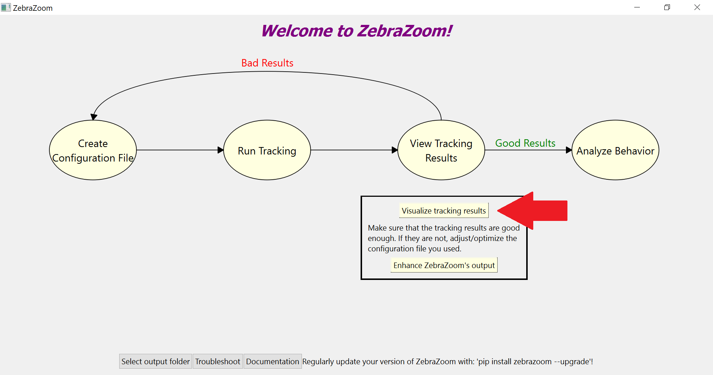
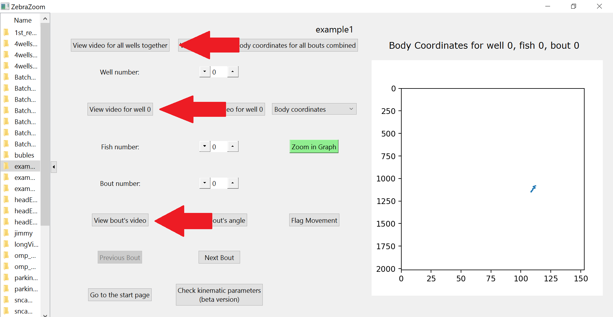
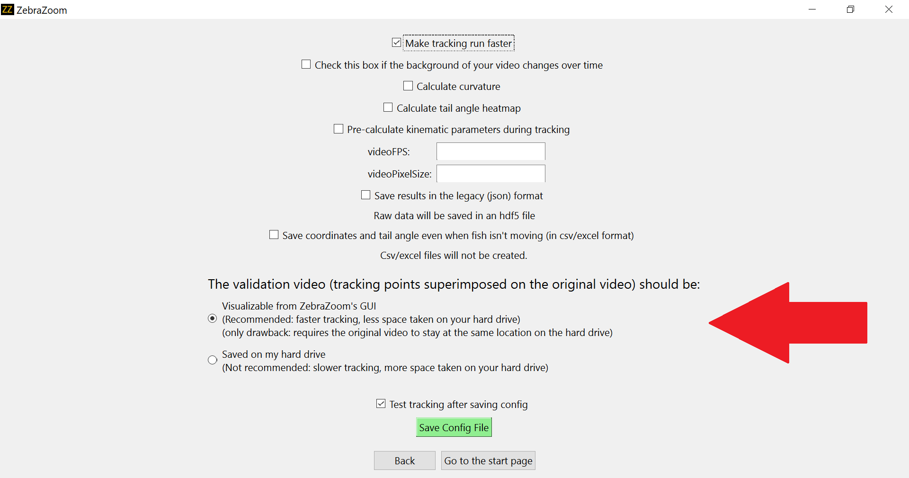
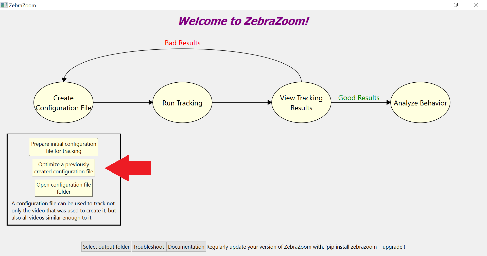
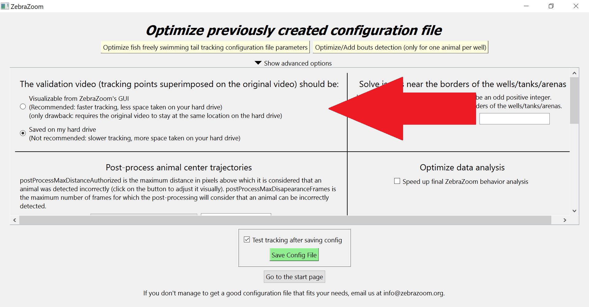
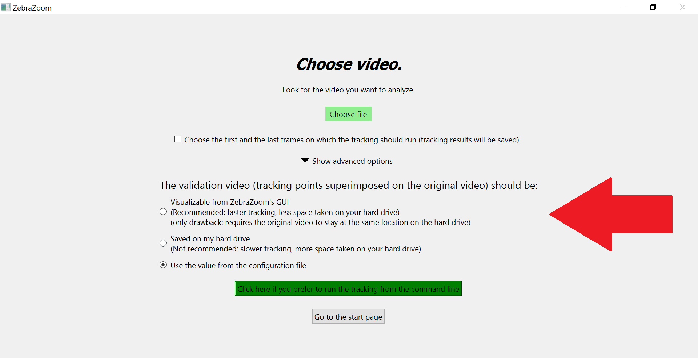
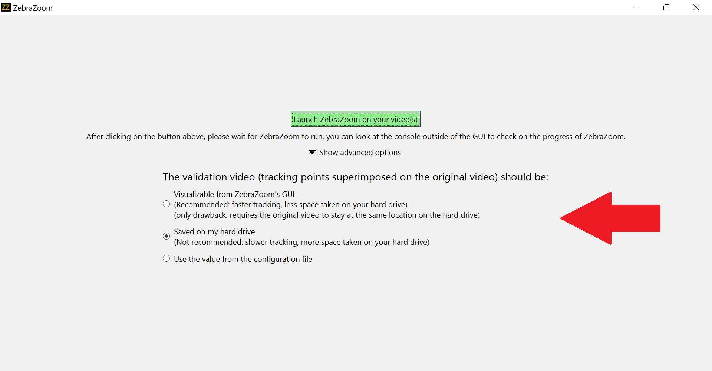

# Validation videos

For every video tracked with ZebraZoom, it is possible to visualize a "Validation video", which is the original video with the points tracked by ZebraZoom superimposed on that original video.

## The two options

This validation video can be either:
- **Saved on your hard drive**: in this case it will be visualizable through ZebraZoom's GUI but you can also open it with any video reading software (vlc, windows player, etc...) since it is saved on your hard drive.
- **Only visualizable through ZebraZoom's GUI**: in this case you can still visualize this validation video using ZebraZoom's GUI, but in this case the validation video is not "physically saved" on your hard drive (in this case the GUI is reopening the original video and putting the tracking points on it as you go from frame to frame while visualizing it).

The second option is recommended because the tracking will run faster and less space will be used on your hard drive. However this second option will require you to keep the original video at the same location as where it was when you originally launched the tracking (the first method does not require that).

## Visualizing validation videos

For both options, you can view validation videos from ZebraZoom's GUI by clicking as shown in these images below:

## Choosing between the two options during the initial configuration file creation

Starting from ZebraZoom version 1.34.1, you can choose at the very end of the configuration file creation pipeline which option you prefer regarding the validation video:

## Modifying the option saved in the configuration file after the configuration file was initially created

Once the configuration file is created, you can still change the option you previously chose by "optimizing the configuration file":

## Changing the option originally chosen right before launching the tracking

And you can also modify the option you chose right before launching the tracking:

### For single video tracking:

### For multiple videos tracking:

## Parameter in configuration file controlling which option is chosen

The parameter controlling which of the two options is chosen is "savePathToOriginalVideoForValidationVideo" which is set to 0 for validation videos to be physically saved on a hard drive and to 1 otherwise.
