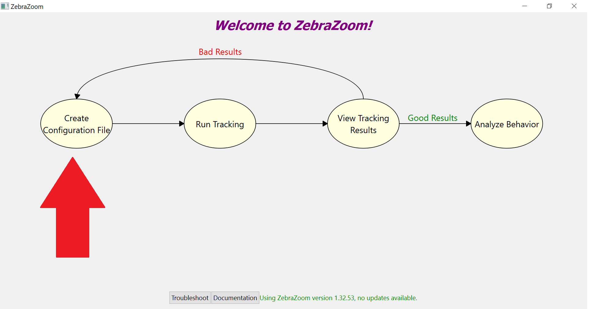
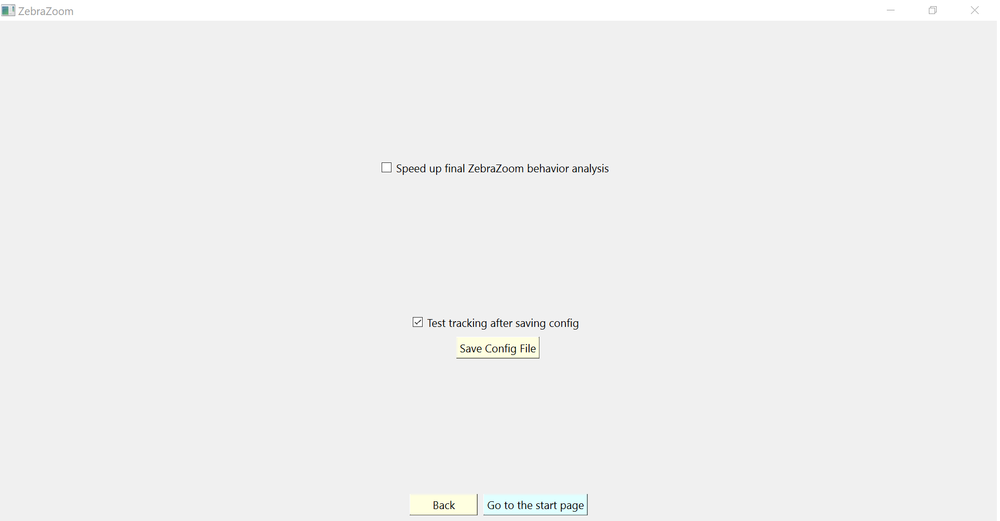
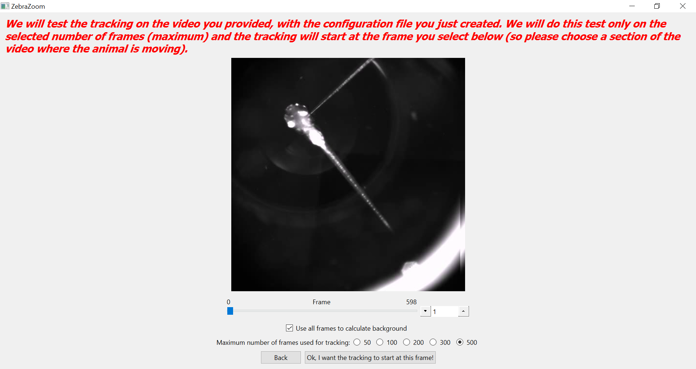
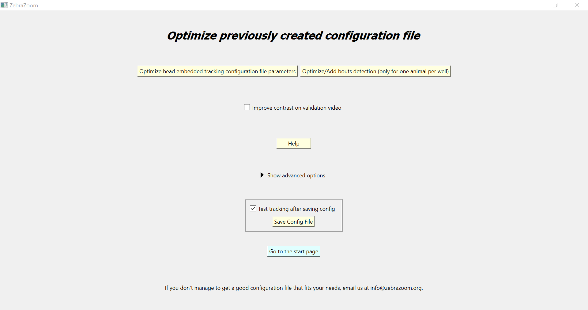
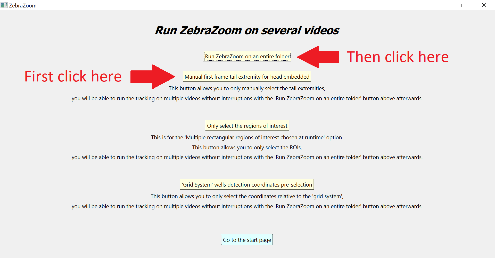
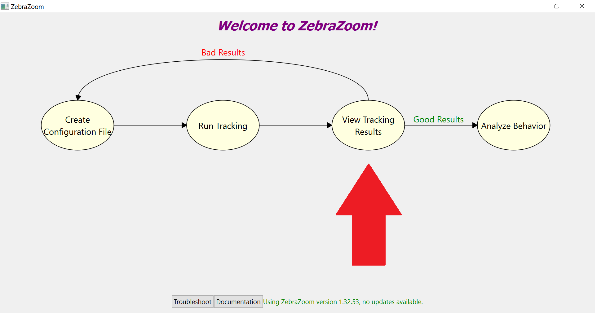
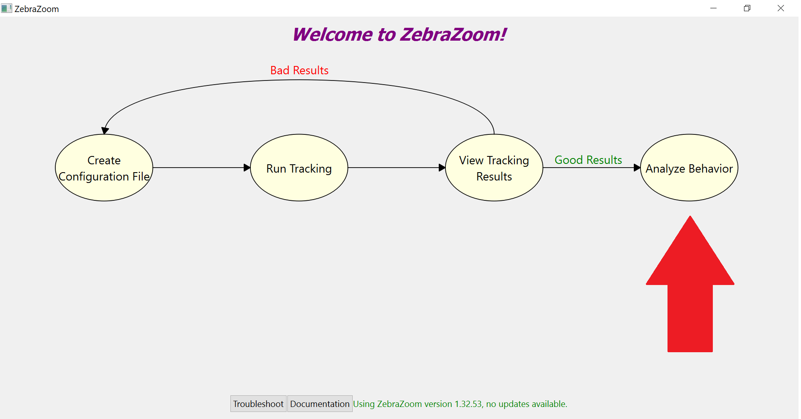
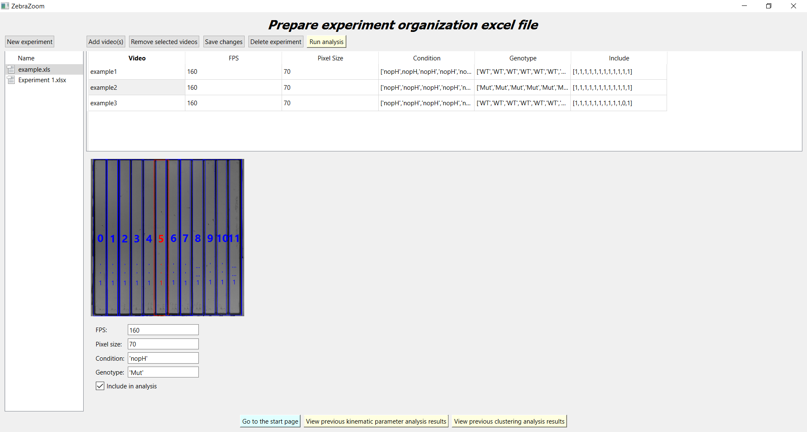
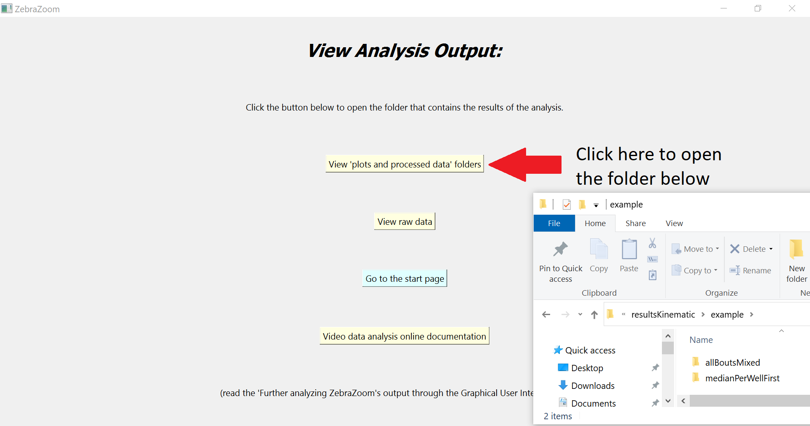

# Head-embedded fish tail tracking

## Installation

### With installer (recommended method)

[Download Windows Installer](https://github.com/oliviermirat/ZebraZoom/releases/latest/download/ZebraZoom-Windows.exe) : [More information for Windows here](/docs/gettingStarted/installation#on-windows)

[Download Mac Installer](https://github.com/oliviermirat/ZebraZoom/releases/latest/download/ZebraZoom-macOS.zip) : [More information for Mac here](/docs/gettingStarted/installation#on-mac)

[Download Linux Installer](https://github.com/oliviermirat/ZebraZoom/releases/latest/download/ZebraZoom-Linux.zip) : [More information for Linux here](/docs/gettingStarted/installation#on-linux)

### With Ananconda

Start by installing [Anaconda](https://www.anaconda.com/products/individual) on your computer. Then install ZebraZoom by typing, in your anaconda prompt:

```
conda create -n zebrazoom python=3.8
conda activate zebrazoom
pip install zebrazoom
```

[More detailed explanations about how to install ZebraZoom](/docs/gettingStarted/installation#general-method)

Then start ZebraZoom by typing, in your anaconda prompt:

```
python -m zebrazoom
```

[More detailed explanations about how to start ZebraZoom](/docs/gettingStarted/startingGUI)


## Configuration file creation

You first need to create a configuration file in order to specify how the videos you want to track are organized, what they contain and what kind of tracking you wish to perform. To create a configuration file, hoover "Create Configuration File" from the main menu of the GUI and click on "Prepare initial configuration file for tracking".



Then answer all the questions asked. Make sure to choose "Tail tracking of head-embedded fish".


As shown on the image below, towards the end of the configuration file creation pipeline, you will be asked to save all the choices you've made into a configuration file. On this page, make sure to keep the checkbox "Test tracking after saving config" checked, this will allow you to check that the configuration file you've just created is well adapted to the video you want to track.



Then, as shown below, slide the cursor in order to place yourself just before a period of time when animals start moving. If your video has a very high resolution and/or if many wells are being detected and tracked, then this tracking may take a bit of time: in that case it can be a good idea to select a "maximum number of frames used for tracking" at lower values (50 or 100 for instance) in order to decrease the tracking time.




The test tracking will then run which may take a few seconds or minutes. Once the tracking is finished, you will see a verification page (shown below) that you will be able to use to test that the tracking worked correctly. Most importantly, you can click on the "View video" buttons to visualize if the tracking points were placed correctly or not. 
If you think that the tracking is of good enough quality, you can click on "Go back to start page". If you think that the tracking was too inaccurate, you should click on "Optimize configuration file".


If you click on "Optimize configuration file", you will be directed to the page shown below. On this page, you can try the different options available in order to try to improve the configuration file. Once you think you have made enough improvements, you can click on "Save Config File": if the "Test tracking after saving config" checkbox is still checked, the same process to test the tracking as shown below will start and you will end up once again on the verification page shown above. Then you can once again choose to stop by clicking on "Go back to start page" if you think that the tracking is good enough or you can click on "Optimize configuration file" if you think that too many errors remain.





### Tutorial videos

Below we show two tutorial videos of how a configuration file is created: the first tutorial video is a situation where no config file optimization is required, whereas the second tutorial video shows an example where optimizing the configuration file initially created is required.

First tutorial video: no config file optimization required:

<iframe width="840" height="472" src="https://www.youtube.com/embed/kCL-kdxWV7k" title="YouTube video player" frameborder="0" allow="accelerometer; autoplay; clipboard-write; encrypted-media; gyroscope; picture-in-picture" allowfullscreen="allowfullscreen" mozallowfullscreen="mozallowfullscreen" msallowfullscreen="msallowfullscreen" oallowfullscreen="oallowfullscreen" webkitallowfullscreen="webkitallowfullscreen"></iframe>

Second tutorial video: optimizing the initially created config file is required:

<iframe width="840" height="472" src="https://www.youtube.com/embed/KZZKCwKgYDw" title="YouTube video player" frameborder="0" allow="accelerometer; autoplay; clipboard-write; encrypted-media; gyroscope; picture-in-picture" allowfullscreen="allowfullscreen" mozallowfullscreen="mozallowfullscreen" msallowfullscreen="msallowfullscreen" oallowfullscreen="oallowfullscreen" webkitallowfullscreen="webkitallowfullscreen"></iframe>


 

## Launching tracking

Once you've created a good configuration file, you can run the tracking on one or several different videos. In order to do this, hoover "Run Tracking" from the main menu of the GUI.


You will be presented with two options:

- "Run ZebraZoom's tracking on a video"

- "Run ZebraZoom's tracking on several videos"

The first option, "Run ZebraZoom's tracking on a video", is very useful when you've just created a new configuration file and you want to (re)-test if it is leading to accurate tracking. If your video might take a long time to track, you can check the box "Test only on a small number of frames" which will allow you to go through the same testing pipeline as in the previously shown configuration file creation pipeline. However, when checking that box, the final results will only be saved temporarily as this is considered a tracking trial run. Alternatively, if you want the tracking to run on a small number of frames and for the final tracking result to be saved in the result folder (not just temporarily), you can click on the checkbox "Choose the first and the last frames on which the tracking should run".

The second option, "Run ZebraZoom's tracking on several videos", will allow you to run the tracking on all the videos present inside a folder. 

As shown below, you should first click on the button "Manual first frame tail extremity for head-embedded": this will allow you to do the manual process of selecting the center of the head and the tail tip for every video in the folder in which you want to track videos (if you do not go through that step first, you will need to click on the coordinates in between each video tracked, which will be very inconvenient).
Once all the manual selection of center of the head and tail tip coordinates is done, you can click on "Run ZebraZoom on an entire folder" in order to run the actual tracking on all videos.




Here is below a tutorial video of how to launch the tracking on several videos, first by selecting the base of the tail and tail tip coordinates, then by launching the actual tracking.

<iframe width="840" height="472" src="https://www.youtube.com/embed/GJwan1YSpAo" title="YouTube video player" frameborder="0" allow="accelerometer; autoplay; clipboard-write; encrypted-media; gyroscope; picture-in-picture" allowfullscreen="allowfullscreen" mozallowfullscreen="mozallowfullscreen" msallowfullscreen="msallowfullscreen" oallowfullscreen="oallowfullscreen" webkitallowfullscreen="webkitallowfullscreen"></iframe>


If you prefer, you can also run the tracking through the command line, you can read information about it [here](/docs/tracking/launchingTracking#launching-the-tracking-through-the-command-line). 

## Tracking quality control

As you start running the tracking on the videos, it will be important to check along the way that the tracking quality is good enough. To do this hoover the "View tracking results" and click on the button "Visualize tracking results".



Then choose the video you tracked in the left column. Most importantly, you can click on the "View video" buttons to visualize if the tracking points were placed correctly or not. 


You can also read more about how to check the [tracking quality](/docs/resultsCheck/trackingCheck), and how to [add flags on bouts](/docs/resultsCheck/flags).

## Behavior analysis

Once you've launched the tracking on several videos and you are confident enough that the tracking is of good enough quality, you can start doing the final behavior analysis. In order to do this, as shown in the image below, start by hoovering the circle "Analyze Behavior" and then click on "Analyze ZebraZoom's output".



Then, as shown below, you will first need to create an experiment organization excel files that summarizes which videos you want to include in your behavior analysis, what each well contains in terms of genotype and condition as well as the number of frames per second of your video recordings (fps) and the pixel size in each video. 



Once you've finished creating your excel organization file, click on the button "Run analysis". As a first step, it is usually best to start by clicking on "Compare population with kinematic parameters" in order to compare kinematic parameters between the different populations present in your study. 
Since you've tracked the tail, you should in most cases check the box "I want fish tail tracking related kinematic parameters (number of oscillations, tail beat frequency, etc...) to be calculated.". 
Once you are used to the pipeline (not the first time you use it), you should also click on "Show advanced options" to try different variations of parameters.
Once the kinematic parameters analysis is finished you should see a page as shown below. By clicking on "View 'plots and processed data' folders" and then on the name of the excel organization file you launched your analysis on, you should see the two subfolders shown below.



The "medianPerWellFirst" folder will contain the kinematic parameters calculated while applying a median on each parameter for all bouts detected inside a well: if only one animal is contained in each well, then this will allow to compare each animal without the potential bias related to some animals that could be doing a lot more bouts than others. It is thus recommended to start by looking at the results in this folder.

The "allBoutsMixed" folder nevertheless contains the kinematic parameters for all bouts mixed, without taking this median per well first.

Both the folders "allBoutsMixed" and "medianPerWellFirst" contain figures comparing the different populations with kinematic parameters as well as excel files containing all these kinematic parameters.

Once you've gained insights from the kinematic parameters analysis, you can then try to run the clustering analysis which works in a similar manner than the kinematic parameters analysis.
