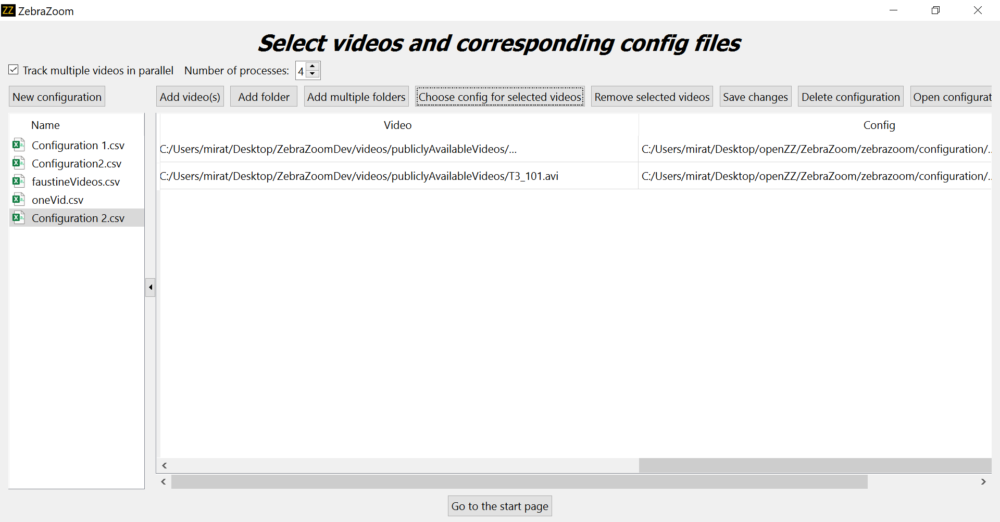
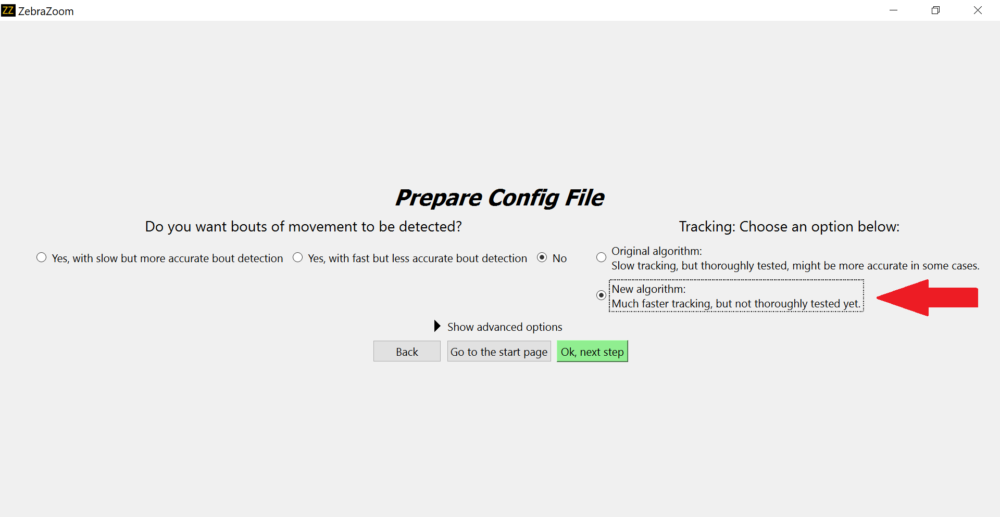

# What's new?

We make changes to ZebraZoom very frequently (often on a daily basis), but in order to avoid overwhelming readers, we only report big major updates as well as changes that could be disruptive to current users on this page. Changelogs for each version can be found on [GitHub](https://github.com/oliviermirat/ZebraZoom/releases).

## September 25 2024: Signed Yaw (deg) and Absolute Yaw (deg) kinematic parameters calculation modified

When calculating these parameters, a point at the third of the length of the tail will now be used. This was previously hardcoded to the 6th point along the tail, regardless of the number of tracking points.

## July 13 2023: Full integration of new hdf5 tracking output format

Major refactoring of the code to allow full integration of the new hdf5 tracking output format, starting from version 1.34.00.

## May 10 2023: Code Refactoring: Base files and tracking files

A major refactoring of all base files (responsible for initial branching of ZebraZoom (GUI opening, tracking launch, etc...)) and of files related to the tracking algorithms has just been released in version 1.33.18.

## September 7 2022 : Changing default tracking algorithm for freely swimming fish from old method to new method in configuration file creation pipeline

Following positive feedback received, the new tracking algorithm for freely-swimming fish introduced on August 18th 2022 is now selected by default in the configuration file creation pipeline (originally, the old tracking algorithm was selected by default). The old tracking algorithm is still easily accessible from the configuration file creation pipeline simply by switching radio buttons.

## August 18 2022 : Tracking speed improvements

### Running several videos in parallel for freely-swimming fish, head-embedded fish, or center of mass only tracking (one fish per well option)

Running several videos in parallel is now much easier thanks to this new GUI feature:

### For freely-swimming fish only

A new algorithm is now available, which you can select in the configuration file creation pipeline simply by choosing the "New algorithm" option on this page (which is not selected by default at the moment):

Importantly, with this new algorithm, no validation videos are saved in the result folders. Even though no validation videos are created, it is still possible to visualize the tracking results by clicking on "View tracking results" on the front page of the GUI and then selecting the name of the tracked video and then clicking on "View video ..." (which is the same method as before): this will read from the raw video and print the tracking points on the raw video as it is being read (instead of reading the validation video created).

To speed things up even more, you can also use the feature mentioned above for running videos in parallel.

### Center of mass only tracking (one animal per well option)

Up until now, center of mass only tracking for one animal per well was very fast when only tracking was performed, but was made much slower when bout detection (through pixel changes between subsequent frames) was introduced. This problem has now been solved and adding bout detection won't make the tracking much slower anymore.

## August 11 2022: Change in kinematic parameter names

Improved clarity by changing kinematic parameter names: 
[github commit](https://github.com/oliviermirat/ZebraZoom/commit/133afc73e86d4cfe74fb330ea5ca341139c27737)